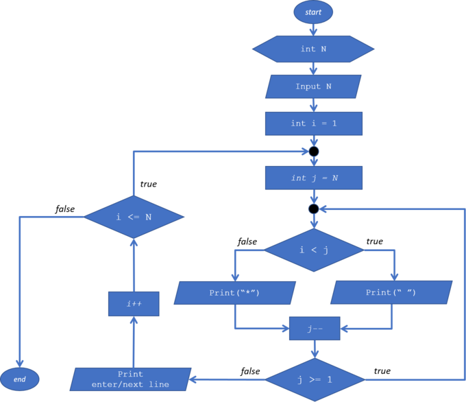

```Java
// NIM   : 2141720027
// NAMA  : M. Muizzuddin Rifqi
// KELAS : D4-TI 1E/14

```

<dl>
  <dt>NIM :</dt>
  <dd>...</dd>

  <dt>Nama :</dt>
  <dd>...</dd>
    
  <dt>Kelas :</dt>
  <dd>...</dd>
</dl>


___


# JOBSHEET 09 - Perulangan 2

## Tujuan
+ Mahasiswa memahami konsep perulangan bersarang (_nested loop_)
+ Mahasiswa dapat menjelaskan format penulisan perulangan bersarang (_nested loop_)
+ Mahasiswa dapat mengimplementasikan _flowchart_ perulangan bersarang menggunakan bahasa pemrograman Java

## Alat dan Bahan
+ PC/laptop
+ Browser(chrome, firefox, safari)
+ Koneksi internet
+ Anaconda3 + Java kernel (opsional)

## Praktikum
### Percobaan 1: Bintang Persegi
1. Perhatikan Flowchart di bawah ini

> flowchart di atas digunakan untuk menggambar sebuah persegi dengan simbol * (bintang)
2. Pada percobaan ke-1 akan dilakukan percobaan tentang _nested loop_. Kasus yang akan diselesaikan adalah untuk membuat tampilan persegi * , dengan panjang sisi sebanyak N. Misalkan N dimasukan **5**, maka hasilnya adalah

3. Karena program membutuhkan input dari keyboard, maka perlu import class Scanner
4. Ketikan kode program di bawah ini


```Java
import java.util.Scanner;

int N;
Scanner sc = new Scanner(System.in);
System.out.print("Masukkan Nilai N : ");
N = sc.nextInt();

for (int i = 0; i <= N; i++) {
    System.out.print("*");
}

```

    Masukkan Nilai N : 5
    ******

5.	Perhatikan sintaks perulangan yang digunakan untuk mencetak * sebanyak N kali ke arah samping. Di tahap 4 di atas kode _looping **for**_ kita jadikan sebagai _**inner loop**_. 
6.	Kita looping lagi _inner loop_ sebanyak N kali untuk menghasilkan _output_ seperti tahap 2. Maka perlu ditambahkan perulangan luar (_outer loop_).


```Java
for (int outer = 1; outer <= N; outer++) {
    for (int i = 0; i <= N; i++) {
        System.out.print("*");
    }
    System.out.println("");
}
```

    ******
    ******
    ******
    ******
    ******
    

#### Pertanyaan 
1. Apakah dengan menggabungkan _inner loop_ dan _outer loop_ seperti langkah 5 di atas sudah menghasilkan _output_ seperti gambar pada langkah 1?
2. Jika belum, silahkan modifikasi kode program sehingga menghasilkan output yang sesuai dengan gambar pada langkah 2?

#### Jawaban
1. Belum
2. Modifikasi program ada di bawah ini


```Java
import java.util.Scanner;

int N;
Scanner sc = new Scanner(System.in);
System.out.print("Masukkan Nilai N : ");
N = sc.nextInt();

for (int outer = 1; outer <= N; outer++) {
    for (int i = 0; i < N; i++) {
        System.out.print("*");
    }
    System.out.println("");
}
```

    Masukkan Nilai N : 5
    *****
    *****
    *****
    *****
    *****
    

***
### Percobaan 2: Bintang Segitiga
1.	Pada percobaan ke-2 akan dilakukan percobaan segitiga * sama siku dengan tinggi sebesar N. Misalkan N dimasukan **5**, maka hasilnya seperti gambar berikut

2. Karena program membutuhkan input dari keyboard, maka perlu import class Scanner
3. Ketikan kode program di bawah ini


```Java
Scanner sc = new Scanner(System.in);
System.out.print("Masukkan Nilai N : ");
int N = sc.nextInt();
int i = 0;

while (i <= N) {
    int j = 0;
    while (j < i) {
        System.out.print("*");
        j++;
    }
    i++;
}
```

    Masukkan Nilai N : 5
    ***************

Amati kode program yang telah kalian tulis di atas.

#### Pertanyaan
1. Perhatikan, apakah output yang dihasilkan dengan nilai N = 5 sesuai dengan  tampilan seperti pada tahap 1 (Percobaan 2)?
2. Jika tidak sesuai, bagian mana saja yang harus diperbaiki/ditambahkan? Jelaskan setiap bagian yang perlu diperbaiki/ditambahkan. 

#### Jawaban
1. Belum Sesuai.
2. Pada bagian sebelum i++ belum ada System.out.println(); maka pada bagian tersebut ditambahkan System.out.println(); agar barisnya berpindah ke bawah.


```Java
Scanner sc = new Scanner(System.in);
System.out.print("Masukkan Nilai N : ");
int N = sc.nextInt();
int i = 0;

while (i <= N) {
    int j = 0;
    while (j < i) {
        System.out.print("*");
        j++;
    }
    System.out.println();
    i++;
}

```

    Masukkan Nilai N : 5
    
    *
    **
    ***
    ****
    *****
    

***
### Percobaan 3: Segitiga Angka
1.	Pada percobaan ke-3 akan dilakukan percobaan segitiga angka sama siku dengan tinggi sebesar N. Misalkan N dimasukan **5**, maka hasilnya seperti berikut

2. Karena program membutuhkan input dari keyboard, maka perlu import class Scanner
3. Ketikan kode program di bawah ini


```Java
import java.util.Scanner;
Scanner input = new Scanner(System.in);

System.out.print("Masukkan Nilai N : ");
int N = input.nextInt();

for (int i = 1; i <= N; i++) {
    for (int j = 1; j <= i; j++) {
        System.out.print(j);
    }
    System.out.println();
}

```

    Masukkan Nilai N : 5
    1
    12
    123
    1234
    12345
    

#### Pertanyaan 
1. Apakah kode program di atas menghasilkan _output_ yang diharapkan?
2. Jika belum, kode program mana yang harus modifikasi? Jelaskan

#### Jawaban
1. Belum sesuai harapan.
2. pada syntax System.out.print(j); diganti menjadi System.out.print(i); agar dalam setiap berpindahnya baris ke bawah angkanya sama.


```Java
import java.util.Scanner;
Scanner input = new Scanner(System.in);

System.out.print("Masukkan Nilai N : ");
int N = input.nextInt();

for (int i = 1; i <= N; i++) {
    for (int j = 1; j <= i; j++) {
        System.out.print(i);
    }
    System.out.println();
}

```

    Masukkan Nilai N : 5
    1
    22
    333
    4444
    55555
    

***
### Percobaan 4: Tebak Angka
1. Pada Percobaan 4 ini, kita akan belajar membuat kode untuk menebak angka menggunakan _nested loop_.
2. Pada percobaan ini kita menggunakan library Scanner untuk menangkap input dari keyboard dan Random untuk meng-generate angka secara acak
3. Ketik dan pahami kode program di bawah ini


```Java
import java.util.Scanner;
import java.util.Random;

Random random  = new Random();
Scanner input = new Scanner(System.in);
char menu = 'y';

do {
    int number = random.nextInt(10) + 1;
    boolean success = false;
    
    do {
        System.out.print("Tebak Angka (1-10) : ");
        int answer = input.nextInt();
        input.nextLine();
        
        if (answer == number) {
            System.out.println("Yay....Tebakan Anda Benar....Selamat!!!");
            success = true;
        }
        
    } while (!success);
    
    System.out.print("Apakah Anda ingin mengulang permainan (Y/y) ?");
    menu = input.nextLine() .charAt(0);
    
} while (menu == 'y' || menu == 'Y');
```

    Tebak Angka (1-10) : 5
    Tebak Angka (1-10) : 4
    Yay....Tebakan Anda Benar....Selamat!!!
    Apakah Anda ingin mengulang permainan (Y/y) ?y
    Tebak Angka (1-10) : 1
    Tebak Angka (1-10) : 2
    Tebak Angka (1-10) : 3
    Tebak Angka (1-10) : 4
    Tebak Angka (1-10) : 5
    Tebak Angka (1-10) : 6
    Tebak Angka (1-10) : 7
    Yay....Tebakan Anda Benar....Selamat!!!
    Apakah Anda ingin mengulang permainan (Y/y) ?t
    

#### Pertanyaan
1. Jelaskan alur program di atas!
2. Apa yang harus dilakukan untuk tidak melanjutkan (tidak mengulangi) permainan tersebut? 
3. Modifikasi program di atas, sehingga bisa menampilkan informasi mengenai : 
    1. input nilai tebakan yang dimasukan oleh user apakah lebih kecil atau lebih besar dari nilai random!
    2. hentikan _nested loop_ jika pengguna gagal menebak angka sampai 10x tebakan, dan beri pesan "Maaf Anda gagal menebak angka sebanyak 10x"

#### Jawaban
1. import java.util.Random digunakan untuk mengacak/merandom angka sehingga kita hanya menebak dan tidak tahu berapa angka yang benar. Kemudian ditambahkan looping untuk mengulangi permainan atau tidak.
2. Menambahkan kondisi jika kita memasukkan char "t/T" maka break/berhenti dari perulangan.


```Java
/* Jawaban untuk Percobaan 4 Pertnyaan 3.A disini */
import java.util.Scanner;
import java.util.Random;

Random random = new Random();
Scanner input = new Scanner(System.in);
char menu = 'y';

do{
    int number = random.nextInt(10)+1;
    boolean succes = false;
    do{
        System.out.print("Tebak angka (1-10) = ");
        int answer = input.nextInt();
        input.nextLine();
        
        if(answer == number){
            System.out.println("Yay....Tebakan anda benar");
            succes = true;
        }else if(answer < number){
            System.out.println("Angka yang dimasukan lebih kecil dari angka yg ditebak");
        }else if(answer > number){
            System.out.println("Angka yang dimasukan lebih besar dari angka yg ditebak");
        }
    }while(!succes);
    System.out.print("Apakah Anda ingin mengulangi Permainan (Y/T)?");
    menu = input.nextLine().charAt(0);
    if(menu == 't' || menu == 'T'){
        break;
    }
    
    
}while(menu == 'y' || menu == 'Y');


```

    Tebak angka (1-10) = 20
    Angka yang dimasukan lebih besar dari angka yg ditebak
    Tebak angka (1-10) = 3
    Angka yang dimasukan lebih besar dari angka yg ditebak
    Tebak angka (1-10) = 2
    Yay....Tebakan anda benar
    Apakah Anda ingin mengulaninya Permainan (Y/T)?y
    Tebak angka (1-10) = 2
    Angka yang dimasukan lebih kecil dari angka yg ditebak
    Tebak angka (1-10) = 3
    Angka yang dimasukan lebih kecil dari angka yg ditebak
    Tebak angka (1-10) = 10
    Angka yang dimasukan lebih besar dari angka yg ditebak
    Tebak angka (1-10) = 4
    Angka yang dimasukan lebih kecil dari angka yg ditebak
    Tebak angka (1-10) = 6
    Yay....Tebakan anda benar
    Apakah Anda ingin mengulaninya Permainan (Y/T)?


```Java
/* Jawaban untuk Percobaan 4 Pertnyaan 3.B disini */
import java.util.Scanner;
import java.util.Random;

Random random = new Random();
Scanner input = new Scanner(System.in);
char menu = 'y';

do{
    int number = random.nextInt(10)+1;
    int i = 1;
    do{
        System.out.print("Tebak angka (1-10) = ");
        int answer = input.nextInt();
        input.nextLine();
        
        if(answer == number){
            System.out.println("Yay....Tebakan anda benar");
            break;
        }else if(answer < number){
            System.out.println("Angka yang dimasukan lebih kecil dari angka yg ditebak");
        }else if(answer > number){
            System.out.println("Angka yang dimasukan lebih besar dari angka yg ditebak");
        }
        i++;
    }while(i<=10);
    if(i>10){
        System.out.println("Maaf Anda sudah menebak salah 10x ");
    }
    System.out.print("Apakah Anda ingin mengulangi Permainan (Y/T)?");
    menu = input.nextLine().charAt(0);
    if(menu == 't' || menu == 'T'){
        break;
    }
    
    
}while(menu == 'y' || menu == 'Y');
```

    Tebak angka (1-10) = 20
    Angka yang dimasukan lebih besar dari angka yg ditebak
    Tebak angka (1-10) = 20
    Angka yang dimasukan lebih besar dari angka yg ditebak
    Tebak angka (1-10) = 20
    Angka yang dimasukan lebih besar dari angka yg ditebak
    Tebak angka (1-10) = 20
    Angka yang dimasukan lebih besar dari angka yg ditebak
    Tebak angka (1-10) = 20
    Angka yang dimasukan lebih besar dari angka yg ditebak
    Tebak angka (1-10) = 20
    Angka yang dimasukan lebih besar dari angka yg ditebak
    Tebak angka (1-10) = 20
    Angka yang dimasukan lebih besar dari angka yg ditebak
    Tebak angka (1-10) = 20
    Angka yang dimasukan lebih besar dari angka yg ditebak
    Tebak angka (1-10) = 20
    Angka yang dimasukan lebih besar dari angka yg ditebak
    Tebak angka (1-10) = 20
    Angka yang dimasukan lebih besar dari angka yg ditebak
    Maaf Anda sudah menebak salah 10x 
    Apakah Anda ingin mengulaninya Permainan (Y/T)?T
    

***
## Tugas
### Soal 1
Buatlah program yang **sesuai** dengan alur _flowchart_ di bawah ini


Apabila kode program sesuai _flowchart_, maka untuk nilai N = 5 akan menghasilkan output seperti gambar berikut


```Java
import java.util.Scanner;
Scanner input = new Scanner(System.in);

int N;
System.out.print("Masukkan Nilai N : ");
N = input.nextInt();

for (int i=1; i<=N; i++) {
    
    for (int j=N; j>=1; j--) {
        if (i<j) {
            System.out.print(" ");
    } 
        else {
            System.out.print("*");
        }
    }
    System.out.println();
}

```

    Masukkan Nilai N : 5
        *
       **
      ***
     ****
    *****
    

***
### Soal 2
Buatlah program untuk mencetak tampilan persegi angka seperti di bawah ini berdasarkan input dari _keyboard_ N (nilai N minimal 3). Contoh N = 3, dan N = 5


```Java
/* Jawaban Soal 2 disini */
import java.util.Scanner;
Scanner input = new Scanner(System.in);

int N;
System.out.print("Masukkan Nilai N : ");
N = input.nextInt();

for (int i=0; i<N; i++) {
    System.out.print(N+ " ");
}

System.out.println();
for (int i=0; i<N-2; i++) {
    System.out.print(N+ " ");
    
    for (int j=0; j<N+1; j++) {
        System.out.print(" ");
    }
    
    System.out.println(N+ " ");
}

for (int i=0; i<N; i++) {
    System.out.print(N+ " ");
}
System.out.println();
```

    Masukkan Nilai N : 5
    5 5 5 5 5 
    5       5 
    5       5 
    5       5 
    5 5 5 5 5 
    

***
### Soal 3
Buatlah program untuk mencetak tampilan piramida * seperti gambar di bawah ini, tinggi piramida berdasarkan input dari _keyboard_ N (nilai N minimal 3). Contoh N = 3, dan N = 5


```Java
import java.util.Scanner;
Scanner input = new Scanner(System.in);

int N;
System.out.print("Masukkan Nilai N : ");
N = input.nextInt();

for (int i=1; i<=N; i++) {
    
    for (int j=N-1; j>=i; j--) {
        System.out.print(" ");
    }
    
    for (int k=1; k<=i; k++) {
        System.out.print("*");
    }
    
    for (int l=1; l<=i-1; l++) {
        System.out.print("*");
    }
    
    System.out.println();
}


```

    Masukkan Nilai N : 5
        *
       ***
      *****
     *******
    *********
    
