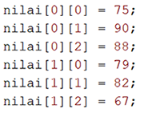
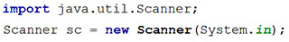
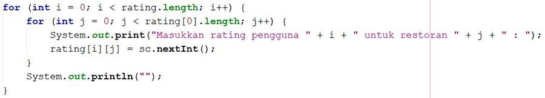
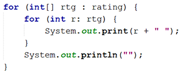
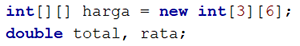
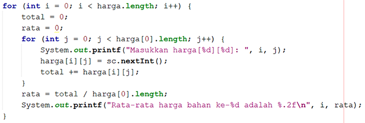
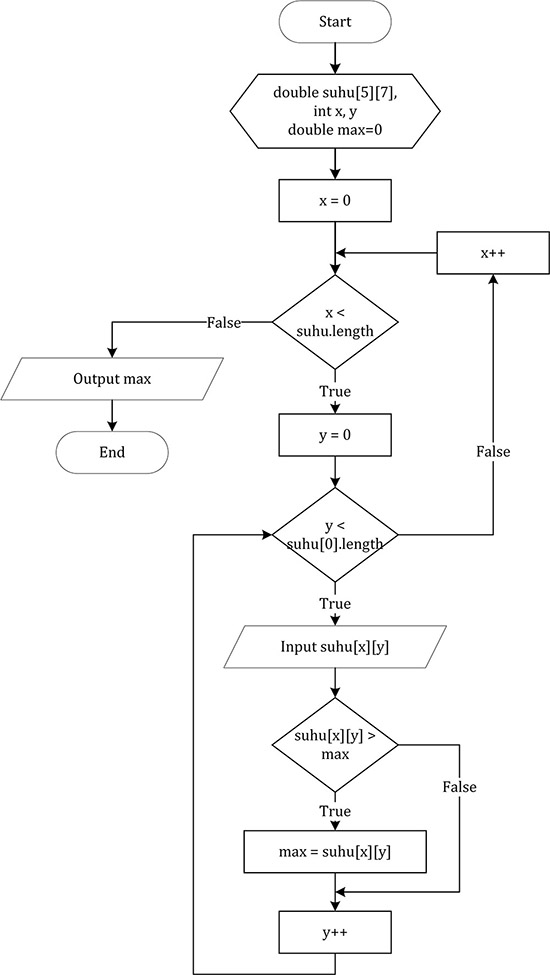
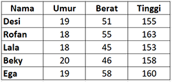

```Java
// Nama  : M. Muizzuddin Rifqi
// Kelas : 1E / 14
// Nim   : 2141720027
```


<div class="burk">
# JOBSHEET 11. ARRAY 2</div><i class="fa fa-lightbulb-o "></i>

## Tujuan
* Mahasiswa mampu memahami pembuatan array dua dimensi
* Mahasiswa mampu menyelesaikan studi kasus dengan memanfaatkan array dua dimensi

## Alat dan Bahan
* PC/Laptop
* Browser
* Koneksi internet
* Anaconda3 + Java kernel (opsional)

## Praktikum

### Percobaan 1: Deklarasi, Inisialisasi, dan Menampilkan Array 2 Dimensi
Pada Percobaan 1, kode program yang dibuat digunakan untuk menyimpan nilai praktikum dari 2 orang mahasiswa pada 3 mata kuliah yang berbeda.
1.	Buat array bertipe **integer** dengan nama **nilai** dengan kapasitas baris 2 elemen (menyatakan jumlah mahasiswa) dan kolom 3 elemen (menyatakan jumlah mata kuliah)


```Java
// Tuliskan kode program Percobaan 1 Langkah 1
int[][] nilai = new int[2][3];
```

2. Isi masing-masing elemen array **nilai** sebagai berikut:



```Java
// Tuliskan kode program Percobaan 1 Langkah 2
nilai[0][0] = 75; 
nilai[0][1] = 90;
nilai[0][2] = 88;
nilai[1][0] = 79;
nilai[1][1] = 82;
nilai[1][2] = 67;
```


    67


3. Tampilkan semua isi elemen array **nilai**


```Java
// Tuliskan kode program Percobaan 1 Langkah 3
System.out.println(nilai[0][0] + " " + nilai[0][1] + " " + nilai[0][2]);
System.out.println(nilai[1][0] + " " + nilai[1][1] + " " + nilai[1][2]);
```

    75 90 88
    79 82 67
    

#### Pertanyaan
1. Apakah pengisian elemen array harus dilakukan secara berurutan mulai dari indeks 0? Jelaskan!

// Tuliskan jawaban nomor 1
Iya, Karena dalam proses tersebut menggunakan proses looping dimana elemen yang ada harus berurutan dan akan diseleksi secara berurutan juga.

2. Lakukan modifikasi pada Percobaan 1 Langkah 3 untuk menampilkan semua isi elemen array **nilai** menggunakan perulangan *for*


```Java
// Tuliskan jawaban nomor 2
int[][] nilai = new int[2][3];

nilai[0][0] = 75; 
nilai[0][1] = 90;
nilai[0][2] = 88;
nilai[1][0] = 79;
nilai[1][1] = 82;
nilai[1][2] = 67;

for (int i=0; i<nilai.length; i++) {
    System.out.println(nilai[i][0]);
    System.out.println(nilai[i][1]);
    System.out.println(nilai[i][2]);
}
```

    75
    90
    88
    79
    82
    67
    

### Percobaan 2: Mengisi Elemen Array 2 Dimensi Menggunakan Input Keyboard
Pada Percobaan 2, kode program yang dibuat digunakan untuk menyimpan nilai rating restoran yang terdaftar pada aplikasi pemesanan makanan online. Rating diberikan oleh 4 orang pengguna kepada 2 restoran yang terdaftar.
1. Import dan deklarasikan Scanner dengan nama **sc**



```Java
// Tuliskan kode program Percobaan 2 Langkah 1
import java.util.Scanner;
Scanner sc = new Scanner(System.in);
```

2.	Buat array bertipe **integer** dengan nama **rating** dengan kapasitas baris 4 elemen (menyatakan jumlah pengguna) dan kolom 2 elemen (menyatakan jumlah restoran)


```Java
// Tuliskan kode program Percobaan 2 Langkah 2
int[][] rating = new int[4][2];
```

3. Dengan menggunakan perulangan *for*, buat input untuk mengisi elemen array **rating**



```Java
// Tuliskan kode program Percobaan 2 Langkah 3
for (int i=0; i < rating.length; i++) {
    for (int j=0; j < rating[0].length; j++) {
        System.out.print("Masukkan rating pengguna " + i + " untuk restoran " + j + " : ");
        rating[i][j] = sc.nextInt();
    }
    System.out.println("");
}
```

    Masukkan rating pengguna 0 untuk restoran 0 : 5
    Masukkan rating pengguna 0 untuk restoran 1 : 4
    
    Masukkan rating pengguna 1 untuk restoran 0 : 5
    Masukkan rating pengguna 1 untuk restoran 1 : 4
    
    Masukkan rating pengguna 2 untuk restoran 0 : 5
    Masukkan rating pengguna 2 untuk restoran 1 : 4
    
    Masukkan rating pengguna 3 untuk restoran 0 : 5
    Masukkan rating pengguna 3 untuk restoran 1 : 4
    
    

###### 4. Dengan menggunakan perulangan *for-each*, tampilkan semua isi elemen dari array **rating**



```Java
// Tuliskan kode program Percobaan 2 Langkah 4
for (int[] rtg : rating) {
    for (int r : rtg) {
        System.out.print(r + " ");
    }
    System.out.println("");
}
```

    5 4 
    5 4 
    5 4 
    5 4 
    

#### Pertanyaan
1. Pada Percobaan 2 Langkah 3, dapatkah posisi i ditukar dengan posisi j? Jelaskan alasannya!

Tuliskan jawaban nomor 1
Tidak bisa, i sebagai baris, j sebagai kolom dimana dalam penulisan indeks harus di depan

2. Tambahkan kode program untuk menentukan banyaknya baris dan kolom elemen array secara dinamis (baris dan kolom ditentukan saat program berjalan melalui input keyboard)!


```Java
// Tuliskan jawaban nomor 2
import java.util.Scanner;
Scanner sc = new Scanner(System.in);

int rating[][] = new int[4][2];
System.out.println("Panjang Baris : " + rating.length);
System.out.println("Panjang Kolom : " + rating[0].length);

for (int i=0; i < rating.length; i++) {
    for (int j=0; j < rating[0].length; j++) {
        System.out.printf("Masukkan Rating Pengguna %d untuk restoran %d : ",i ,j);
        rating[i][j] = sc.nextInt();
    }
    System.out.println("");
}

for (int[] rtg : rating) {
    for (int r : rtg) {
        System.out.print(r+" ");
    }
    System.out.println("");
}
```

    Panjang Baris : 4
    Panjang Kolom : 2
    Masukkan Rating Pengguna 0 untuk restoran 0 : 5
    Masukkan Rating Pengguna 0 untuk restoran 1 : 3
    
    Masukkan Rating Pengguna 1 untuk restoran 0 : 2
    Masukkan Rating Pengguna 1 untuk restoran 1 : 4
    
    Masukkan Rating Pengguna 2 untuk restoran 0 : 5
    Masukkan Rating Pengguna 2 untuk restoran 1 : 1
    
    Masukkan Rating Pengguna 3 untuk restoran 0 : 3
    Masukkan Rating Pengguna 3 untuk restoran 1 : 5
    
    5 3 
    2 4 
    5 1 
    3 5 
    

### Percobaan 3: Melakukan Operasi Aritmatika pada Elemen Array 2 Dimensi
Pada Percobaan 3, kode program yang dibuat digunakan untuk menghitung nilai rata-rata harga setiap bahan pokok selama 1 semester. Terdapat 3 bahan pokok yang dicatat harganya setiap akhir bulan. Program dibuat berdasarkan flowchart berikut.

1. Import dan deklarasikan Scanner dengan nama **sc**


```Java
// Tuliskan kode program Percobaan 3 Langkah 1
import java.util.Scanner;
Scanner sc = new Scanner(System.in);
```

2.	Buat array bertipe **integer** dengan nama **harga** dengan kapasitas baris 3 elemen (menyatakan jumlah bahan pokok) dan kolom 6 elemen (menyatakan jumlah bulan). Deklarasikan juga variabel **total** dan **rata** bertipe **double**



```Java
// Tuliskan kode program Percobaan 3 Langkah 2
int[][] harga = new int[3][6];
double total, rata;
```

3. Dengan menggunakan perulangan *for*, buat input untuk mengisi elemen array **harga**. Kemudian, perhitungan total harga dilakukan untuk setiap bulan (kolom) pada setiap bahan pokok (baris). Setelah itu, nilai rata-rata dihitung untuk setiap bahan pokok (tiap satu baris) dan ditampilkan



```Java
// Tuliskan kode program Percobaan 3 Langkah 3
for (int i=0; i < harga.length; i++) {
    total = 0;
    rata = 0;
    for (int j=0; j < harga[0].length; j++) {
        System.out.printf("Masukkan harga [%d] [%d] : ", i, j);
        harga[i][j] = sc.nextInt();
        total += harga[i][j];
    }
    
    rata = total / harga[0].length;
    System.out.printf("Rata - rata harga bahan ke-%d adalah %.2f\n", i, rata);
}
```

    Masukkan harga [0] [0] : 2000
    Masukkan harga [0] [1] : 3000
    Masukkan harga [0] [2] : 4000
    Masukkan harga [0] [3] : 5000
    Masukkan harga [0] [4] : 6000
    Masukkan harga [0] [5] : 7000
    Rata - rata harga bahan ke-0 adalah 4500.00
    Masukkan harga [1] [0] : 2000
    Masukkan harga [1] [1] : 2000
    Masukkan harga [1] [2] : 2000
    Masukkan harga [1] [3] : 2000
    Masukkan harga [1] [4] : 2000
    Masukkan harga [1] [5] : 2000
    Rata - rata harga bahan ke-1 adalah 2000.00
    Masukkan harga [2] [0] : 4000
    Masukkan harga [2] [1] : 5000
    Masukkan harga [2] [2] : 4000
    Masukkan harga [2] [3] : 3000
    Masukkan harga [2] [4] : 2000
    Masukkan harga [2] [5] : 1000
    Rata - rata harga bahan ke-2 adalah 3166.67
    

#### Pertanyaan
1. Jelaskan fungsi dari **rata = total / harga[0].length**!

// Tuliskan jawaban nomor 1
Untuk menghitung rata dengan rumus total dibagi panjang kolom baris ke 0 dimana bernilai 6

## Tugas

1. Perhatikan flowchart berikut.

Buat kode program sesuai dengan flowchart tersebut untuk mencari suhu tertinggi yang dicatat dari 5 kota di Jepang selama 7 hari berturut-turut!


```Java
// Tuliskan jawaban nomor 1
import java.util.Scanner;
Scanner sc = new Scanner(System.in);

double[][] suhu = new double[5][7];
int x, y;
double max = 0;

for(int x=0; x < suhu.length; x++) {
    for(int y=0; y < suhu[0].length; y++) {
        System.out.print("Masukkan Suhu " +x +y + " : ");
        suhu[x][y] = sc.nextInt();
        if(suhu[x][y] > max) {
            max = suhu[x][y];
        }
    } 
    
    System.out.println("Suhu Tertinggi di Jepang adalah : " + max);   
}

```

    Masukkan Suhu 00 : 20
    Masukkan Suhu 01 : 30
    Masukkan Suhu 02 : 25
    Masukkan Suhu 03 : 27
    Masukkan Suhu 04 : 25
    Masukkan Suhu 05 : 26
    Masukkan Suhu 06 : 20
    Suhu Tertinggi di Jepang adalah : 30.0
    Masukkan Suhu 10 : 20
    Masukkan Suhu 11 : 40
    Masukkan Suhu 12 : 30
    Masukkan Suhu 13 : 20
    Masukkan Suhu 14 : 20
    Masukkan Suhu 15 : 20
    Masukkan Suhu 16 : 30
    Suhu Tertinggi di Jepang adalah : 40.0
    Masukkan Suhu 20 : 25
    Masukkan Suhu 21 : 25
    Masukkan Suhu 22 : 34
    Masukkan Suhu 23 : 25
    Masukkan Suhu 24 : 34
    Masukkan Suhu 25 : 24
    Masukkan Suhu 26 : 23
    Suhu Tertinggi di Jepang adalah : 40.0
    Masukkan Suhu 30 : 20
    Masukkan Suhu 31 : 20
    Masukkan Suhu 32 : 20
    Masukkan Suhu 33 : 23
    Masukkan Suhu 34 : 23
    Masukkan Suhu 35 : 24
    Masukkan Suhu 36 : 24
    Suhu Tertinggi di Jepang adalah : 40.0
    Masukkan Suhu 40 : 25
    Masukkan Suhu 41 : 24
    Masukkan Suhu 42 : 23
    Masukkan Suhu 43 : 22
    Masukkan Suhu 44 : 21
    Masukkan Suhu 45 : 20
    Masukkan Suhu 46 : 26
    Suhu Tertinggi di Jepang adalah : 40.0
    

2. Terdapat hasil pencatatan data lima mahasiswa yang berisi informasi mengenai umur, berat badan (kg), dan tinggi badan (cm). Data tersebut disimpan ke dalam array dua dimensi.

*Keterangan: penyimpanan nilai dapat dilakukan melalui inisialisasi menggunakan operator assignment*
 * Tampilkan *berat badan terendah* di antara kelima mahasiswa tersebut
 * Tampilkan *rata-rata tinggi badan* dari kelima mahasiswa tersebut
 * Tampilkan nama mahasiswa dengan *umur tertua* di antara kelima mahasiswa tersebut


```Java
// Tuliskan jawaban nomor 2
int[][] dataMhs = {
    {19,51,155},
    {18,55,163},
    {18,45,153},
    {20,46,158},
    {19,58,160},
};

int i, j;
int antepeAwak = 100;

for (i=0; i < dataMhs.length; i++) {
    for (j=0; j < dataMhs[0].length; j++) {
        if (dataMhs[i][1] < antepeAwak) {
            antepeAwak = dataMhs[i][1];
        }
    }
}

System.out.println("Berat Badan Terendah Mahasiswa : " + antepeAwak + " Kg");

double totalDukur = 0;
double rataDukur = 0;

for (i=0; i<dataMhs.length; i++) {
    for (j=0; j < dataMhs[0].length; j++) {
        if (j == 2)
            totalDukur += dataMhs[i][j];
    }
}

rataDukur = totalDukur / dataMhs.length;
System.out.println("Total Tinggi Badan = " +totalDukur+ " Cm");
System.out.println("Rata-rata tinggi badan Mahasiswa yaitu " +rataDukur+ " Cm");

String[] nama = {"Desi", "Rofan", "Lala", "Beky", "Ega"};

int indeks;
int umur = 0;
for (i=0; i < dataMhs.length; i++) {
    for (j=0; j < dataMhs[0].length; j++) {
        if(dataMhs[i][0] > umur) {
            umur = dataMhs[i][0];
            indeks = i;
        }
    }
}
System.out.print("Umur tertua dari kelima Mahasiswa tersebut yaitu umur " +umur+ " yang bernama " +nama[indeks]);
```

    Berat Badan Terendah Mahasiswa : 45 Kg
    Total Tinggi Badan = 789.0 Cm
    Rata-rata tinggi badan Mahasiswa yaitu 157.8 Cm
    Umur tertua dari kelima Mahasiswa tersebut yaitu umur 20 yang bernama Beky
